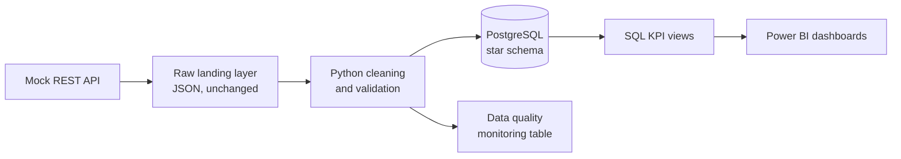

# Customer Service Operations Analytics: BPO Case Study

An end-to-end analytics project built around a realistic business problem: **a BPO contact center where customer satisfaction is falling while contact volume and handle time rise.** The goal is to find out why, and to build the data pipeline that keeps answering that question as new data arrives.

> **Status: in progress.** See the [roadmap](#roadmap) for what is finished and what is next.
>
> **About the data:** all data in this project is **synthetic**. It comes from a mock contact-center REST API and was generated with deliberately messy records (duplicates, mixed date formats, inconsistent labels, invalid values). No real customers, agents, or companies are involved.

---

## The business problem

Management at a BPO customer service operation handles voice, chat, and email contacts across five teams. Over the last quarter, customer satisfaction has dropped. Contact volume and average handle time have both increased.

The analysis aims to answer:

- What changed, and when?
- Which teams, channels, and issue types are affected?
- Is the problem related to volume, staffing, handle time, or first-contact resolution?
- Are escalations increasing? Is SLA deteriorating?
- Is there a relationship between QA scores and customer satisfaction?
- Which agents or teams are outliers?

The project ends with recommendations supported by the data, not just charts.

## Architecture



| Stage | What happens |
|---|---|
| **Extract** | Authenticated, paginated requests to the API. Incremental pulls with `updated_since`. Retry handling for rate limits and temporary errors. |
| **Raw layer** | Responses are saved exactly as received, so cleaning can always be re-run and audited. |
| **Clean and validate** | Standardize text, dates, and categories. Remove duplicates. Flag invalid values and outliers. Validate schema, ranges, and referential integrity. |
| **Load** | Idempotent loads into PostgreSQL, so the pipeline can be re-run safely when new data arrives. |
| **KPI layer** | SQL views (CTEs, window functions, date functions) that calculate business KPIs. |
| **Dashboards** | Power BI reports connected to the SQL views. |

## Data source

A mock contact-center platform API serving seven resources: `teams`, `agents`, `customers`, `interactions`, `surveys`, `qa-evaluations`, and `shifts`.

- Authenticated with an API key header
- Paginated (`limit` up to 500, `offset`)
- Supports incremental loading through `updated_since`
- Simulates "new data arriving" over time
- Has an optional mode that produces random `429` and `503` errors, for practicing retry logic

The clean version of the data is kept separately and is not used until the cleaning stage is finished. It is then used to check what the pipeline caught and what it missed.

## KPIs

CSAT and DSAT, Average Handle Time (AHT), First Contact Resolution (FCR), Service Level (SLA), Abandonment Rate, Escalation Rate, Transfer Rate, Repeat Contact Rate, Backlog, QA Score, Customer Effort Score, Agent Occupancy, and Schedule Adherence.

Formal definitions, formulas, and targets: `docs/kpi_definitions.md` *(in progress)*.

## Tech stack

| Area | Tools |
|---|---|
| Extraction | Python, `requests` |
| Cleaning | Python, `pandas` |
| Storage | PostgreSQL |
| Analytics | SQL |
| Dashboards | Power BI |
| Automation | Scheduled jobs *(planned)* |

## Repository structure

```
.
├── source_system/        # mock API and data generator (synthetic)
├── extract/              # API extraction scripts
├── raw_landing/          # raw API responses (not committed)
├── transform/            # cleaning and validation          (planned)
├── sql/                  # schema, load scripts, KPI views  (planned)
├── dashboards/           # Power BI file and documentation  (planned)
├── docs/                 # KPI definitions, data dictionary (planned)
└── README.md
```

## Roadmap

- [x] Define the business problem and KPI framework
- [x] Set up the source API and explore its endpoints
- [x] Build the extraction script with pagination
- [ ] Add retry handling and incremental loading
- [ ] Profile the raw data and document every quality issue found
- [ ] Design the PostgreSQL schema and ERD
- [ ] Build the cleaning and validation pipeline
- [ ] Load the data into PostgreSQL
- [ ] Build the SQL KPI layer
- [ ] Build the Power BI dashboards
- [ ] Add a data-quality monitoring layer
- [ ] Automate the pipeline
- [ ] Write up findings and recommendations

## Lessons learned so far

- **Read the API docs instead of guessing.** My first extractor paginated with `page=1, 2, 3…`. The API paginates by `offset`, and the server silently ignored the unknown parameter. I loaded the same 100 rows repeatedly. `offset` counts rows to skip, so the next page starts at `offset + limit`, not `offset + 1`.
- **Save raw data before cleaning it.** Going straight from the API to a cleaned file hides the problems you are supposed to find, and makes the pipeline impossible to audit.
- **Know your own bugs from real data problems.** Duplicates created by a faulty loop and duplicates that exist in the source data need different fixes.

## Running the project

*Setup instructions will be added as each stage is completed.*

## Findings

*Coming soon: root-cause analysis, key insights, and recommendations.*

## Screenshots

*Dashboard screenshots will be added here.*

---

## About

Built by **[Your Name]** as a portfolio project to practice SQL, PostgreSQL, API data extraction, Python ETL, data modeling, and BI dashboards on a realistic business problem.

[LinkedIn](https://www.linkedin.com/in/your-profile) · [Email](mailto:you@example.com)
